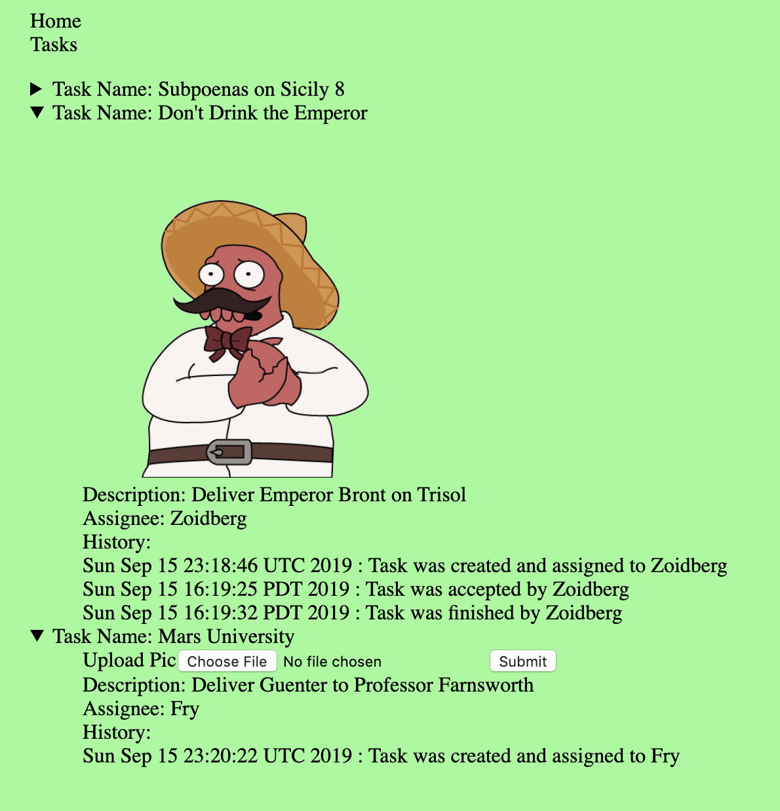

# Taskmaster Frontend

## Overview

This is the ultra simple react frontend for the [Taskmaster](https://github.com/hotandfresh/taskmaster) application. Taskmaster is an api that consists of tasks. This front end displays the title, description, assignee, image and history of a task.

## Features

This react application consists of two fragments. One fragment is the nav and the other fragment is Tasks. The Task fragment is where most of the work is happening. Inside Task is the api call to the backend and there is functionality to display those tasks.

To add task and have it show, navigate to the [backend](https://github.com/hotandfresh/taskmaster) for directions.

## Screenshot

## Deployed Link

This application is currently hosted on the Amazon S3 service. The site is [here](http://alltasks.s3-website-us-west-2.amazonaws.com/).

## Backend Repo

This [taskmaster repo](https://github.com/hotandfresh/taskmaster) was used.
